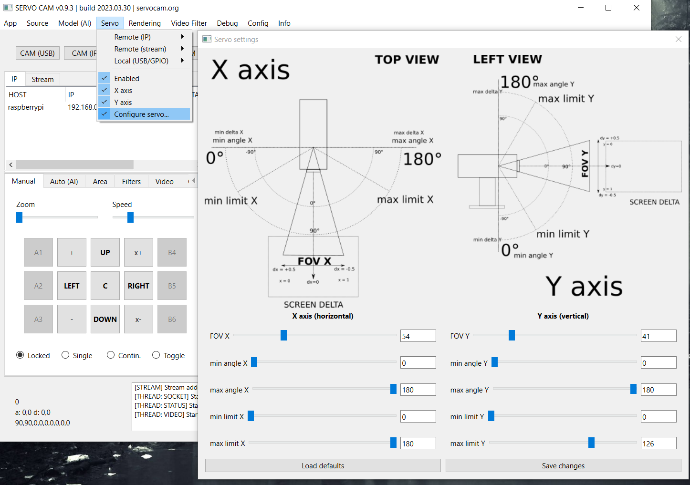

Hardware
========

Camera (CSI, USB)
-----------------

The camera can be connected both via the USB connector directly to the
computer with the server application, and via the CSI connector to e.g.
Raspberry (then the video from the camera will be transmitted remotely
from the client via the network/WiFi to the server application). Local
connection (directly to the server application, e.g. via USB) offers faster 
data transfer than the remote video transfer via the network.

**Note:** Please note that whenever you change the camera model to
camera with other angles of view (FOV), you need to update the configuration 
in the "config.ini" file. You must specify the correct viewing angle
for the connected camera (FOV / Field Of View). This is required for
correct mapping of the screen coords to the movements of the servos. Camera with given
incorrect FOV (i.e. not matching true angle of view) can generate too slow 
or too fast and not good servo movement.

Viewing angles (FOV) must be defined in the **config.ini** file and via **Servo > Configure servo...*** menu:

.. code-block:: ini

	# config.ini

	camera.idx = 0
	camera.fov.x=54 #<-------
	camera.fov.y=41 # <-------
	camera.width = 1280
	camera.height = 720
	camera.fps = 30

Other options, such as capture resolution, or the number of captured frames per second
(fps) can also be set in the file, but note - these options may not work for every camera.

The **camera.idx** parameter can be used to specify the numerical ID of the camera in operating system if you need to select this camera automatically when starting the application.

On the side of the application itself, video capture is done using
**OpenCV** and **imutils** libraries.

**Note:** on one device at a time, the camera can only be active in one
application (using it by one application blocks the possibility of using
it in another application).

Servos
------

Servos can be physically connected in several ways: 
using an Arduino-type microcontroller or using a minicomputer
with built-in **GPIO pins of the PWM type**, e.g. Raspberry.
In the next releases, it is planned to add the possibility of handling 
any external system with a driver for servos.

Connecting the servos can be done both on the side of the server
application (e.g. Arduino or Raspberry should be connected directly to
the USB port of the machine on which the server application is running)
and on the side of the client application (e.g. on a Raspberry or other
computer remotely connected to the network ) - commands to the
servomotors will then be sent remotely from the server towards the
client via the network.

In the case of connecting via Arduino, the code attached to the 
**Client / Arduino** directory must be uploaded to the Arduino board. 
The code should be uploaded to the Arduino, e.g. using the Arduino IDE. 
In the case of connection via Raspberry, the client application from the
**Client / PC, Raspberry** directory must be uploaded to Rasberry.

The project requires two servos to work: one for movement along the
X (horizontal) axis, the other for movement along the Y (vertical) axis.
The servos must be properly calibrated with the camera, i.e. the camera
directed at the central base point should be physically attached to the
platform in such a way that the servos are then in their default,
initial position (e.g. 90/90 degrees for servos with the maximum
operating range 180 degrees).

In order for commands to servos to be transmitted at all, 
the **Enabled** in the **Servo menu** in the server application must be
enabled. For a locally connected servo, select the serial port for
communication with a local controller (e.g. Arduino) in the same menu,
it can be done in the menu **Servo > Local > (port name)**. For a
remotely connected device (e.g. using a Raspberry client) select the
appropriate remote option in the menu **Servo > Remote > (IP address of the remote device)**.

In the application, you can optionally activate movement only along a given axis (X
or Y) using the appropriate option in the **Servo** menu. Thanks to this, you can 
enable movement along only one axis, e.g. along the X axis, depending on your needs. 
**Note:** if no local or remote servos are selected in the options in the menu, 
then no servo commands are passed on. An active servo also forces the **Lock Center** 
option in the view settings to be enabled, which locks the center point of the
screen.

Additional (default) operating parameters of the servos can be
configured in the **config.ini** file:

.. code-block:: ini

	# config.ini
	servo.enabled = 1
	servo.enabled.x = 1
	servo.enabled.y = 1
	servo.local = /dev/ttyACM0
	servo.remote = 192.168.0.2
	servo.map_fov = 1

If there is a need to start the servos automatically (when starting the application), 
enter the servo port in **servo.local** parameter for locally connected servo, or enter 
the IP address of the remote device with the client application in **servo.remote** 
parameter in case of remote servo control.

The **map_fov** option allows for more accurate motion mapping,
taking into account the real angle of view of the camera and it should always be
enabled (value = **1**) to get the best translation of motion into the
servo. A description of all options and parameters can be found in the
further part of the documentation.

**At the moment, servos with a maximum deflection angle of 180 degrees are supported.**

360 degree servos will be supported in future releases.

**Note:** when transmitting commands responsible for the movement of the
servo, the **Lock Center** option in the **Rendering > Lock Center**
menu will always be enabled. The option is activated automatically when
you enable sending commands to the server. To disable it, you must first
disconnect from the servomotors. This behaviour does not apply to the video source
- when playing a movie, you can disable locking the center of the screen
at the center point.

**Note:** the servo requires precise configuration of the operating
parameters and proper setting of the pulses, as well as the maximum tilt
angles that the servo can perform - all these parameters must be defined
in the configuration files. A detailed description of the parameters can
be found in the further part of the manual.

**Tip:** From release >=0.9.3 you can configure all those base options via **Servo > Configure servo...** settings window:

**Note:** if you are using Arduino then you must also specify correct pulse range in **Arduino** code (available in **Client** directory):

.. code-block:: c++

	#define SERVO_X_PULSE_MIN 771 // servo X min pulse
	#define SERVO_X_PULSE_MAX 2193 // servo X max pulse
	#define SERVO_Y_PULSE_MIN 771 // servo Y min pulse
	#define SERVO_Y_PULSE_MAX 2193 // servo Y max pulse

If you are using Raspberry GPIO pins to control the servos then specify these options in **config.ini** placed in client's directory:

.. code-block:: ini

	# config.ini

	# SERVO PARAMS
	servo.use_limit = 0
	servo.angle.start.x = 90
	servo.angle.start.y = 90
	servo.angle.min.x = 0
	servo.angle.min.y = 0
	servo.angle.max.x = 180
	servo.angle.max.y = 180
	servo.limit.min.x = 0
	servo.limit.min.y = 0
	servo.limit.max.x = 180
	servo.limit.max.y = 180
	servo.freq.x = 50
	servo.freq.y = 50
	servo.delay.x = 0.02
	servo.delay.y = 0.02
	servo.cycle.start.x = 0
	servo.cycle.start.y = 0
	servo.cycle.min.x = 2.5
	servo.cycle.min.y = 2.5
	servo.cycle.max.x = 12.5
	servo.cycle.max.y = 12.5
	servo.angle.multiplier.x = 1
	servo.angle.multiplier.y = 1

**Tip:** The appropriate operating parameters of your servo can be found in the manufacturer's documentation. You can also try to set these parameters by trial and error method, sending commands to the servo manually and trying to find the appropriate values at which the servo responds best.

**INCORRECT SERVOS CONFIGURATION MAY DAMAGE THEM!**