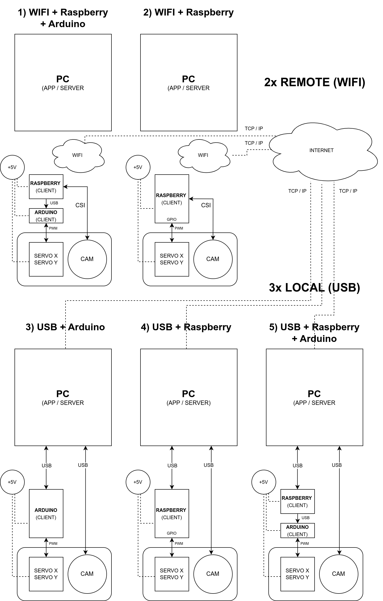
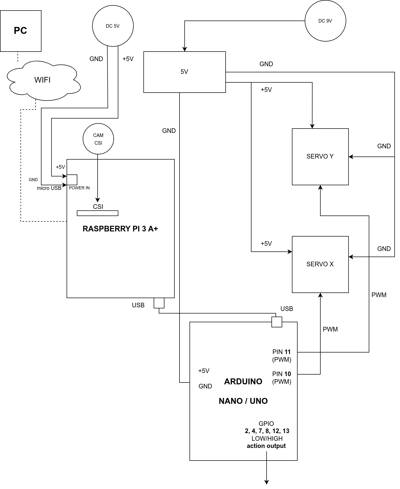
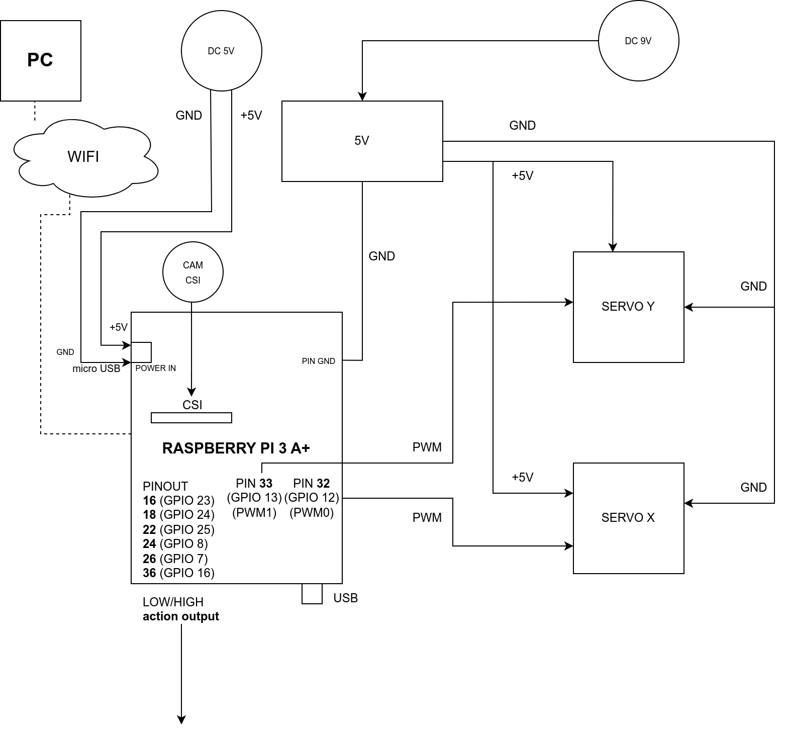
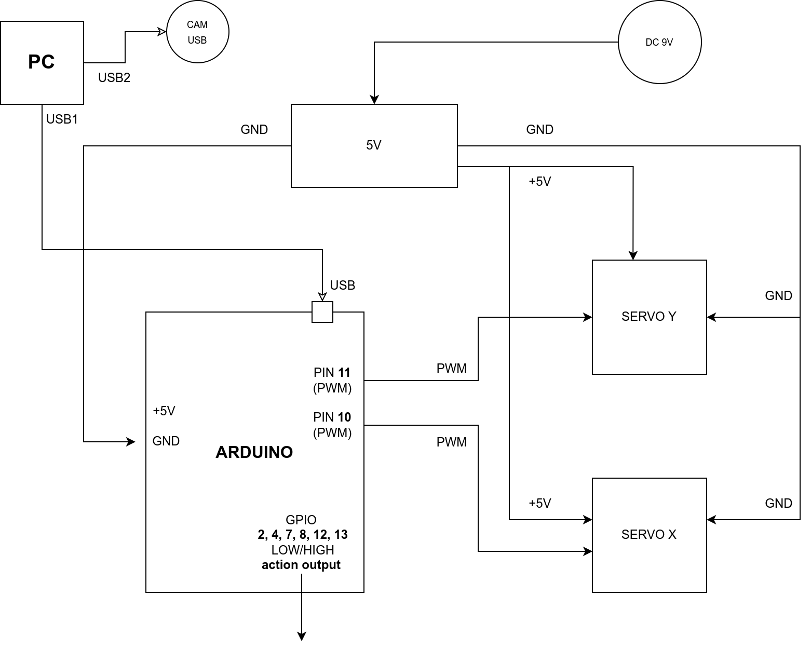
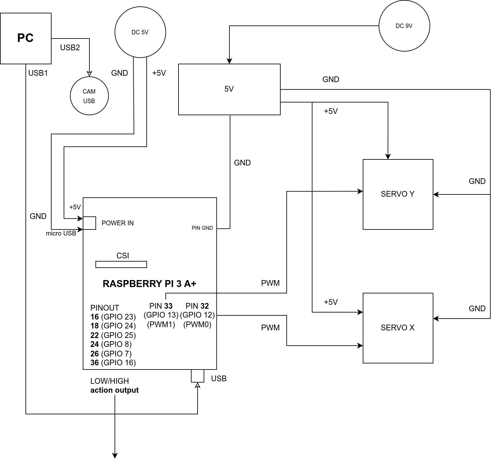

Requirements and connection
===========================

Hardware
--------

The following main components are required to build the project:

-  **USB**, **HDMI** or **CSI** camera 
-  **2x servo** - one each for X and Y axes
-  **hardware driver for servos** - possible solutions: Arduino microcontroller or minicomputer in the form of Raspberry Pi/Jetson Nano or external servo driver/controller

Software 
--------

System requirements for bundled software:

- **Windows 10** (64bit) for Windows version (desktop)
- **Linux** (64bit) for Linux version (desktop)
- **optional:** web browser with GPU support for the browser version (Google Chrome recommended)
- the included software supports **PC (Windows, Linux)**, **Raspberry Pi** and **Arduino**.

No GPU is required to run the software.

In the absence of a GPU, all calculations will be done by the CPU.

Sample Components
------------------

Below is a list of components required to prepare an example construction with links to an example store (Botland):

Local connection (PC + Arduino)
~~~~~~~~~~~~~~~~~~~~~~~~~~~~~~~

| **Arduino Nano:**
| https://botland.store/arduino-nano-boards/12960-arduino-nano-module-a000005-7630049200173.html
| **Arducam OV2710 2Mpx 1/2.7' USB camera:**
| https://botland.store/arduino-rpi-cameras/16896-arducam-ov2710-camera-2mpx-1-27-usb-automatic-ir-cut-filter-1080p-arducam-b0205-5904422345136.html
| **Camera mount:**
| https://botland.store/rpi-zero-mounting-elements/20898-pro-mini-camera-mount-holder-for-the-official-camera-and-raspberry-pi-zero-pihut-tph-069-5904422382735.html
| **IR-CUT camera mount:**
| https://botland.store/raspberry-pi-camera-accessories/10324-ir-cut-camera-case-open-black-5904422315542.html10324-obudowa-do-kamery-ir-cut-otwarta-czarna-5904422315542.html
| **2x standard-size servo Tower Pro MG995 + Pan/Tilt Kit:**
| https://botland.store/grapplers-and-gimbals/2546-pantilt-servo-bracket-kit-servos-dagu-6952581600800.html
| **Aluminum servo mount Feetech FK-MB-001:**
| https://botland.store/grapplers-and-gimbals/9208-aluminium-servo-mount-feetech-fk-mb-001-black-5904422312992.html
| **Aluminum servo horn Feetech FK-RP-001 - 20mm / 6mm:**
| https://botland.store/servo-horns-hooks/9198-round-aluminum-servo-horn-feetech-fk-rp-001-20mm-6mm-5904422337698.html
| **Hub USB 2.0 4-ports Esperanza EA-112:**
| https://botland.store/usb-hubs/1199-usb-20-hub-4-ports-esperanza-ea-112-5905784768564.html
| **5V power supply module with DC socket:**
| https://botland.store/power-modules/9420-power-module-33v-5v-with-dc-jack-5904422313302.html
| **Switching power supply 9V/2A:**
| https://botland.store/socket-power-supply/7158-power-supply-9v-2a-dc-55-21mm-5902135147375.html
| **2x 60cm servo extension cable:**
| https://botland.store/servo-wires/648-extension-cord-for-servos-60cm-5904422329549.html
| **5m active USB extension cable:**
| https://botland.store/usb-adapters/3860-active-usb-extension-cable-5m-5904100201327.html

Remote connection (PC + Raspberry / Arduino / WiFi)
~~~~~~~~~~~~~~~~~~~~~~~~~~~~~~~~~~~~~~~~~~~~~~~~~~~

| **Raspberry Pi 3 A+ with microUSB power supply:**
| https://botland.store/raspberry-pi-3a/13834-set-of-raspberry-pi-3a-wifi-original-case-power-supply-5v-25a-5903351241526.html
| **Arduino Nano:**
| https://botland.store/arduino-nano-boards/12960-arduino-nano-module-a000005-7630049200173.html
| **Goodram memory card M1AA microSD 16GB 100MB/s UHS-I klasa 10 with adapter:**
| https://botland.store/microsd-sd-cards/2123-memory-card-m1aa-goodram-microsd-16gb-100mb-s-5908267930137.html
| **Card reader CY BOX USB 3.0 - CF, SD, microSD:**
| https://www.amazon.co.uk/ICY-BOX-Reader-microSD-Memory/dp/B07B4R53WG
| **Camera HD Night Vision E OV5647 5Mpx - for Raspberry Pi + IR modules - Waveshare 10300 CSI:**
| https://botland.store/raspberry-pi-cameras/4522-camera-hd-night-vision-e-ov5647-5mpx-for-5904422332860.html
| **Raspberry Pi camera CSI tape 60cm, 15 wires, raster 1mm:**
| https://botland.store/raspberry-pi-camera-accessories/2440-raspberry-pi-camera-ribbon-wire-60cm-15-wires-5904422359157.html
| **Camera mount:**
| https://botland.store/rpi-zero-mounting-elements/20898-pro-mini-camera-mount-holder-for-the-official-camera-and-raspberry-pi-zero-pihut-tph-069-5904422382735.html
| **2x standard-size servo Tower Pro MG995 + Pan/Tilt Kit:**
| https://botland.store/grapplers-and-gimbals/2546-pantilt-servo-bracket-kit-servos-dagu-6952581600800.html
| **Aluminum servo mount Feetech FK-MB-001:**
| https://botland.store/grapplers-and-gimbals/9208-aluminium-servo-mount-feetech-fk-mb-001-black-5904422312992.html
| **Aluminum servo horn Feetech FK-RP-001 - 20mm / 6mm:**
| https://botland.store/servo-horns-hooks/9198-round-aluminum-servo-horn-feetech-fk-rp-001-20mm-6mm-5904422337698.html
| **5V power supply module with DC socket:**
| https://botland.store/power-modules/9420-power-module-33v-5v-with-dc-jack-5904422313302.html
| **Switching power supply 9V/2A:**
| https://botland.store/socket-power-supply/7158-power-supply-9v-2a-dc-55-21mm-5902135147375.html
| **2x 60cm servo extension cable:**
| https://botland.store/servo-wires/648-extension-cord-for-servos-60cm-5904422329549.html
| **Raspberry Pi 3 A+ case transparent open:**
| https://botland.store/raspberry-pi-cases/13535-case-for-raspberry-pi-3-a-transparent-open-5904422320843.html

Possible connection configurations
----------------------------------

Below is a summary diagram of all possible configurations in which all
the equipment can operate in the current version. The equipment can be
connected both **locally** and **remotely**.

Each of the connections has its pros and cons and its limitations - a
local connection offers the lowest delays and the fastest data transfer,
however, at the cost of lack of mobility, similarly, a remote connection
causes minimal delays in data transfer, but allows remote control of the
whole. The choice of connection method depends only on your own needs,
requirements and technical capabilities. The software has been prepared
to ensure operation in each of these configurations. There is also the
possibility of controlling from the level of the public network
(internet) - this will be described in the appropriate chapter.

The package includes prepared software for **PC**, **Raspberry** and
**Arduino**. The software architecture and the technologies used have
been selected so as to eliminate as many delays as possible and ensure
the fastest possible real-time data transfer.

For remote connection, instead of the Raspberry described in the
examples, any PC can be used, e.g. a Lenovo mini-computer, or any other.
The software also allows for any combination of structures, i.e. in any
combination, **any PC, Raspberry or Arduino** can be the connector with
the hardware. In future releases, support for **Nvidia Jetson** is
also planned (as a client and as a self-sufficient server due to
sufficient computing power).

**Note:** when Raspberry is connected, servo control can be done using
its built-in GPIO pins, however, a much better solution is to control
servos using a microcontroller like Arduino (higher control current,
less interference, greater reliability, etc.). The optimal option is,
for example, connecting the Raspberry (or other computer) via Wifi, and
connecting the Arduino to the Raspberry via the serial interface (USB)
and then connecting the servo only to the Arduino outputs. The commands are then 
received via Wifi using the Raspberry and forwarded to the Arduino via USB 
- in this case only the Arduino deals with communication with the hardware. 

All possible connection configurations are described below.

WIFI/LAN + Raspberry Pi + Arduino
~~~~~~~~~~~~~~~~~~~~~~~~~~~~~~~~~

In this configuration, the computer controlling the device (server)
connects to the client (which can be a **Raspberry** or any other PC)
via **LAN** or **WLAN/WIFI**. **Raspberry** uses **Arduino**
connected via the USB port to control the servos using the **GPIO pins
of the PWM type from the Arduino** microcontroller and captures video from 
the camera connected via the **CSI** connector and then sends
the video to the server via the network. The control computer (server) 
sends servo control commands to the client over the network. To use
this configuration, run on the Raspberry the client application
available in the **Client / PC, Raspberry** directory and then on 
the desktop (server) application, select the remote mode **CAM (IP)** 
and then select the servo connection from **Servo > Remote > (client IP address)** 
menu. If another computer (PC) with e.g. Arduino will be used instead of Raspberry, 
run the client application from the **Client / PC, Raspberry** directory 
on it and select **arduino** as the device in client's configuration.

Connecting pins in **Raspberry** (remotely) and **Arduino**, on the
example of **Raspberry Pi 3 Model A+**:

**The Arduino pin configuration can be changed in the C++ code included
for Arduino - the code is in the Client/Arduino directory.**

**Installation procedure of the client application on Raspberry,
Arduino and PC is described in more detail in a separate chapter -
Software / Client.**

**In the next releases, an additional option is planned to connect
servomotors using any hardware driver for servos.**

WIFI/LAN + Raspberry Pi
~~~~~~~~~~~~~~~~~~~~~~~

In this configuration, the computer controlling the whole (server)
connects to the client (which can be a **Raspberry** or any other PC)
via **LAN** or **WLAN/WIFI**. The Raspberry, using the built-in **GPIO
pins of the PWM type,** controls the servos and captures video from
the camera connected via the **CSI** connector and then sends the video to
the controlling computer via the network. The control computer then
sends servo control commands to the client over the network. To use this
configuration, run the client application available in the **Client /
PC, Raspberry** directory on the Raspberry, and then on the
desktop (server) application, select the **CAM (IP)** mode and then select 
the servo connection in **Servo > Remote > (client IP address).** menu.
If another computer (PC) with e.g. Arduino will
be used instead of Raspberry, run the client application from the
**Client / PC, Raspberry** directory on it and select **arduino** as 
the device in client's configuration.

Connecting pins in **Raspberry** (remotely), on the example of
**Raspberry Pi 3 Model A+**:

**The ground (GND) of the servo power supply must be additionally
connected to the GND pin of the Raspberry in this system.**

**Note:** instead of via the microUSB input (as in the diagram), the
Raspberry can be connected directly to the 5V power board using the 5V
and GND output pins in the Raspberry. However, this is not recommended
due to the circumvention of all internals in this configuration. current
protection in Raspberry.

The configuration of pins for Raspberry can be changed in the
**config.ini** file located in the directory with the client application
and installed in the user's directory in the system (pins in the
configuration should be defined **according to physical addresses**
on the board, not with GPIO names):

.. code-block:: ini

   # config.ini
   client.device.raspberry.pin.servo_x = 32
   client.device.raspberry.pin.servo_y = 33
   client.device.raspberry.pin.action_A1 = 16
   client.device.raspberry.pin.action_A2 = 18
   client.device.raspberry.pin.action_A3 = 22
   client.device.raspberry.pin.action_B4 = 24
   client.device.raspberry.pin.action_B5 = 26
   client.device.raspberry.pin.action_B6 = 36

**Installation procedure of the client application on Raspberry,
Arduino and PC is described in more detail in a separate chapter -
Software / Client.**

**In the next releases, an additional option is planned to connect
servomotors using any hardware driver for servos.**

USB + Arduino
~~~~~~~~~~~~~

In this configuration, the computer controlling the whole (server) is
connected to the **Arduino microcontroller** via a serial port (**USB**). 
Arduino, using the built-in **GPIO pins of the PWM type,** controls
the servos. The camera must be connected directly to the control
computer via the USB port. The control software here takes care of the
computational part and controls the movement of the servo motors with
the connected Arduino by passing commands to it. To use this
configuration, you need to upload the control code written in C++ to the
Arduino (code is attached in the **Client / Arduino** directory), and then on 
the desktop (server) application, select **CAM (USB)** mode and then select 
the USB camera from the list and select the servo connection using option 
in the **Servo > Local > (serial port address)** menu.

Connecting pins in **Arduino** (locally), on the example of **Arduino
Uno** / **Arduino Nano**:

The pin configuration can be changed in the C++ code
included for Arduino - the code is in the **Client / Arduino** directory.

USB + Raspberry Pi
~~~~~~~~~~~~~~~~~~

**Note:** serial connection with Raspberry requires configuration on the
Raspberry side, Arduino is recommended for local connection, and
Raspberry is recommended only for handling remote connections.

In this configuration, the computer controlling the whole (server) is
connected to the Raspberry via a serial port (**USB**). The Raspberry
uses the built-in **GPIO pins of the PWM type** to control the servos
here. The camera must be connected directly to the control computer via
the USB port. The control software here takes care of the computational
part and controls the movement of the servo motors via the connected
Raspberry by passing commands to it. To use this configuration, run the
client application available in the **Client / PC, Raspberry** directory
on the Raspberry, and then on the desktop (server)
application, select the **CAM (USB)** operating mode and select the USB
camera from the list and select the servo connection using the options
in the **Servo > Local > (serial port address)**  menu. In this
configuration, any computer can be used instead of a Raspberry.

Connecting pins in **Raspberry** (locally), on the example of
**Raspberry Pi 3 Model A+**:

**Note:** instead of via the microUSB input (as in the diagram), the
Raspberry can be connected directly to the 5V power board using the 5V
and GND output pins in the Raspberry. However, this is not recommended
due to the circumvention of all internals in this configuration. current
protection in Raspberry.

The pin configuration can be changed in the **config.ini** file -
located in the directory with the client application, this file is
copied to the user's directory during the first run and should be edited
there.

USB + Raspberry Pi + Arduino
~~~~~~~~~~~~~~~~~~~~~~~~~~~~

The configuration is analogous to the connection configuration via Wifi,
with the only difference that the connection to the Raspberry / PC is
via the USB port instead of via WiFi.