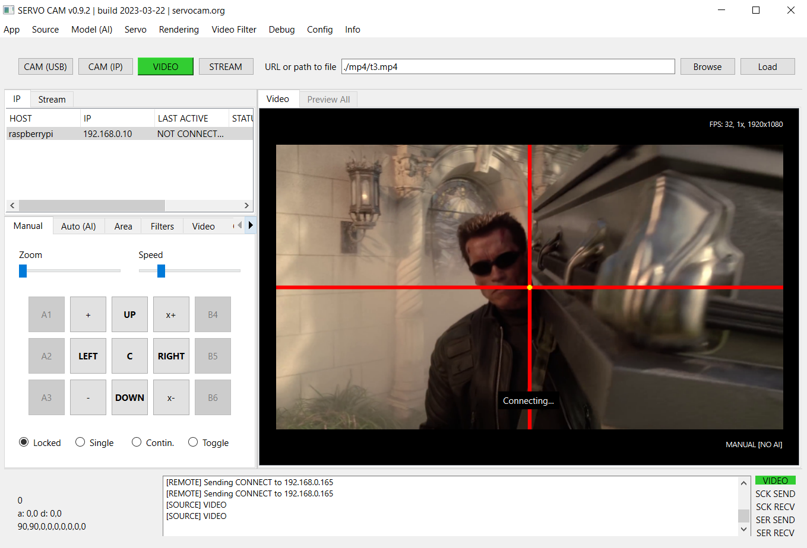

Software
========

General architecture
--------------------

The software consists of several cooperating components - they are
divided into individual directories:

1. **App/Server** - server (management) application, run on a
   managing/calculating machine, **PC: Windows 10 or Linux**
2. **Client** - client applications (physically controlling the
   hardware), run on a machine physically connected to the servo and
   camera: **Raspberry, Arduino or PC: Windows 10 or Linux**
3. **Web** - web application, i.e. a separate version of the
   application, which can be run under a web browser, allowing you to
   control servos using a browser on a computer or smartphone.

The server application and the web application can operate
simultaneously as a server + client (i.e. it is possible to connect the
hardware directly to them via a USB port - then a separate client
application is not required and the whole thing can be controlled
locally directly from the server application).

In the case of web applications, it is required to run a web server. A
production webserver, e.g. **Nginx** is recommended due to greater
efficiency and reliability, but it is also possible to run the whole
thing using a simple webserver for Python built-in **(Flask)** framework,
included in the package.

Server applications have been prepared for two operating systems:
**Windows 10** and **Linux** - they are portable, i.e. they
do not require any installation in the system, just unpack the archive -
all libraries required for work are contained locally in their
directories. The desktop application code was written in Python v3.10,
PyInstaller was used to prepare binary/executable versions for Windows
and Linux.

App/Server - server application (Windows, Linux)
------------------------------------------------

The desktop server application that manages the whole thing is
designed to run on the user's computer, which will control the operation
of the mechanism. It is located in the **App (Server)** directory and is
available for Windows and Linux.

In the local operating mode, the Application allows for connection of
all accessories (USB camera and microcontroller in the form of e.g.
Arduino or Raspberry to control servos) directly to the computer on
which the application is running. In the second mode - remote operation,
it allows you to manage the equipment connected to the remote device
(the so-called client, e.g. a Raspberry minicomputer with a client
application running and a CSI camera and a controller for servos
connected), communication then takes place via the network/WiFi.

Camera and servo connection options
~~~~~~~~~~~~~~~~~~~~~~~~~~~~~~~~~~~

Local Mode - CAM (USB)
^^^^^^^^^^^^^^^^^^^^^^

In this mode, both the camera and the microcontroller (e.g. Arduino) or
Raspberry computer are connected directly via USB ports to the same
machine on which the server application is running.

As the operating mode, select the **CAM (USB)** in order to
get an video capture from the camera connected directly to the USB port.
In the **Servo** menu select the **Local > (serial port)** option from the
list, where **(serial port)** is the name under which it is
available, e.g. Arduino with servos connected. The port name may vary
depending on the operating system and devices already connected, e.g.
**COM5** on Windows and **/dev/ttyACM0** or **/dev/ttyUSB0** on Linux.

In this operating mode, the server application here behaves
simultaneously as a client and server, working with locally connected
hardware.

Remote Mode - CAM (IP)
^^^^^^^^^^^^^^^^^^^^^^

In the **CAM (IP)** remote operation mode, the server connects to the
remote client application (running e.g. on a Raspberry minicomputer or
any other computer connected via the network/WiFi) and remotely
receives only the video capture from the camera from the client application,
and then performs all calculations and controlling the whole by remotely
sending control commands to the client (who then sends them further to
the servo).

To connect to a remote client application, select **CAM (IP)** mode, 
and then enter the host name or IP address under which the client
machine is available in the network. Then select the **Connect /
activate** option from the context menu available with the right mouse
button (PPM) on the list of connected clients located on the left side
of the main program window in the **IP** tab.

**NOTE:** the connection to the client can sometimes be lost for various
reasons, e.g. due to a physical power failure of the remote machine. The
application then automatically attempts to resume such connections in
order to restore communication, but if this fails, then to restore the
connection manually, you must reconnect to the client (again selecting
the **Connect / activate** option). In the context menu on the list of
clients, there are also options such as **Restart**, which restarts the
connection on the client's machine, and the **Destroy** option,
which shuts down the client application remotely and restarts it if a
Supervisor type application is installed on the client. This may be
useful, for example, in the event of any problems with the operation of
the client application on the client's computer.

When working with a remote client, only one client is active on the
screen at a time, however video data is received all the time from all
connected clients simultaneously. This can be used by selecting the
**Preview** tab , which will show in one window a summary image from all
simultaneously connected clients.

The list of clients, which will be loaded automatically into the
application at the time of its launch, can be prepared manually by
editing the **hosts.txt** file located in the directory with the server
application and copied to the user's directory during the first launch.
In this file, the names of client computers should be given, each in a
separate line and according to the scheme **host [space] IP [space]
description** , as shown below:

.. code-block:: ini

   hostname1 ip1 name1
   hostname2 ip2 name2
   hostname3 ip3 name3

Sample **hosts.txt** file:

.. code-block:: ini

   raspberry1 192.168.0.2 kitchen
   raspberry2 192.168.0.3 lobby

The hosts (clients) from this file are loaded into the program
automatically when it is launched.

Thanks to this, you can prepare a list of your own devices, which will
be loaded automatically and will significantly speed up clients
management. The hosts file can also be edited directly from the server
application: **Menu > Configuration > Edit hosts.txt**.

Remote mode - STREAM (webserver, HTTP / MJPEG)
^^^^^^^^^^^^^^^^^^^^^^^^^^^^^^^^^^^^^^^^^^^^^^

**STREAM** remote mode the server connects to the webserver run by the
remote client application (running e.g. on a Raspberry minicomputer or
any other computer connected via the network/WiFi) and downloads only
the camera image from the webserver, and then takes care of all
calculations and control of the whole by sending remote control commands
to client via HTTP (the client then forwards the commands to the servo).

To connect to a remote web server, select the **STREAM** mode, and then
enter the host name or IP address and port under which the client
machine is available in the network. Then select the **Connect /
activate option** from the context menu available with the right mouse
button (PPM) on the list of addresses with stream located on the left
side of the main program window in the **STREAM** tab.

When working with a remote web server, only one client is active on the
screen at a time.

**streams.txt** is a file located in the directory with the server
application and copied to the user's directory during the first launch.
In this file, the names of client computers should be given, each in a
separate line and according to the scheme **protocol://host:port [space]
description**, as shown below:

.. code-block:: ini

   protocol1://hostname1:port1 name1
   protocol2://hostname2:port2 name2
   protocol3://hostname3:port3 name3

Sample **streams.txt** file:

.. code-block:: ini

   http://192.168.0.2:8888 kuchnia
   http://192.168.0.3:8888 korytarz

Stream addresses from this file are loaded into the program
automatically when it is launched.

If a security token is used for the connection, it should be added to
the entry after the **pass=** prefix.

Example:

.. code-block:: ini

   http://192.168.0.2:8888 kitchen pass=12345

Thanks to this, you can prepare a list of your own devices, which will
be loaded automatically and will significantly speed up host management.
The streams file can also be edited directly from the server application:
**Menu > Configuration > Edit streams.txt**.

**To be able to connect via the webserver, the client must be started
with the ``web=1`` option:**

.. code-block:: console

   python ./client.py --web=1

**Note:** the web connection is slower than the IP connection (via
sockets) - there may be delays in video transmission when simultaneously
sending control commands and during the entire working time, the video
may be delayed by approx. 500ms in relation to the video sent using the
socket method.

Modes of work with different video sources
~~~~~~~~~~~~~~~~~~~~~~~~~~~~~~~~~~~~~~~~~~

The server application can work with 4 different video sources:

-  **CAM (USB)** - control of a camera connected locally to the USB
   port, and servos locally connected via the USB port, e.g. using
   Arduino
-  **CAM (IP)** - remote control via sockets of the camera and
   servomotors connected via the network, e.g. to Raspberry Pi or to
   another remote computer
-  **VIDEO** - the ability to run a video file instead of the video from
   the camera
-  **STREAM** - the ability to receive a stream (IPTV) or connect and
   control servers via a webserver built into the client

**CAM (USB)**

In this mode, connect the camera to the USB port of the computer on
which the server application is running. The servos should be connected
to the Arduino or Raspberry, and the Arduino or Raspberry should be
connected to the same computer via the USB port and then select this
port in the application in the **Servo > Local > (port name)** menu.

**Note:** the port must be available to the application, using it at the
same time by another application will block its use here. If the system
lacks drivers, e.g. for Arduino, you must first install the appropriate
drivers provided by the manufacturer.

**CAM (IP)**

In this mode, the server application connects remotely (via the network
/ WiFi) with an external computer (client) to which the camera and
servos are connected. Communication then takes place using the TCP
protocol, the image from the camera is then sent remotely from the
client to the server, and control commands are sent from the server to
the client via a network socket (socket).

The role of the client to which the camera and servos can be remotely
connected can be any computer, e.g. a regular desktop, mini-desktop or
Raspberry. The only requirement is that it should be available via the
network/WiFi and that it should provide physical communication (control)
with servos, e.g. using an Arduino connected to the USB port, or
directly through its GPIO PWM pins (if the customer is e.g. Raspberry).

**Connecting to clients (IP)**

To connect to a remote client, the client application (from the **Client
directory**) must be running on it.

Then, using the server application, enter the **client's IP address** 
under which it is available in the network in the address
bar at the top of the window:

After entering the address and clicking the **Connect** button, an
attempt will be made to connect to the client, and the client should
appear on the list of clients on the left side of the program window:

In case of connection problems, make sure that the client application is
running on the client machine and that the host/IP addresses are
correct. In case of problems, you can also use the **Restart** or
**Destroy** options available from the context menu (RMB) in the list
of clients.

The list of clients loaded when starting the server application can be
edited in the **hosts.txt** file located in the directory with the
server application.

At a given moment, one client can be managed from the level of the
server application, however, the connection is maintained with all
connected clients, therefore, using the **Preview** tab, you can view
the current preview from all simultaneously connected clients and e.g.
switch to the appropriate client using the list of clients by selecting
the option **Connect / Activate**.

**Tip:** On the client's computer, along with the client application,
software for managing processes in the system should also be installed,
e.g. Supervisor, which can automatically restart the finished
application in the event of problems. The client application should also
be loaded into memory with the system startup (autostart), if it is
running on, for example, a Raspberry.

The Supervisor application can be downloaded from the manufacturer's
website: http://supervisord.org/

**VIDEO**

In this mode, you can load any video file (e.g. mp4) from the disk or
URL, and then run the tracking mode on it. The mode can be useful, for
example, for testing purposes, to test the behavior on video material.

**STREAM**

In this mode, you can load a remote stream from a URL, e.g. from IPTV,
by specifying the address to the m3u8 file.

This allows you to connect an image from an external stream.

In this mode, you can also connect to a client working in **web** mode
(with a running webserver). Such a connection can be more stable than a
socket / IP connection (the webserver is running all the time, there is
no need to establish a permanent connection between sockets), but the
image can be sent with a greater delay. Support for the stream mode is
similar to the **CAM (IP)** mode, with the difference that the
connection goes through the web server built into the client. Using this
mode, you can remotely control the server - commands are sent to the
webserver and interpreted by the webserver.

Control modes
~~~~~~~~~~~~~

The control of the whole is divided into 2 main modes: manual and
automatic.

In the left part of the window there are tabs for selecting the
appropriate mode and additional tools.

**Tabs description:**

-  **Manual** - allows you to remotely control the mechanism
   using buttons and mouse, zoom, and manually turn on/off the action
-  **Auto (AI)** - allows you to automatically control the mechanism
   using built-in artificial intelligence (AI) models
-  **Area** - allows you to limit the working modes for AI by
   setting the allowed area on the screen
-  **Filters** - allows you to filter object types, e.g. specifying
   classes for detected objects or their minimum scoring
-  **Video** - allows you to control the video image
-  **Options** – allows live configuration of the basic parameters of
   the tracking mode and servo operation (these and all other parameters
   are configurable in the **config.ini** file)

Manual mode
^^^^^^^^^^^^
In this mode, you can control the entire mechanism manually.

Using the mouse (with the left button pressed - LMB), you can move the
mechanism by moving the mouse around the area with the image from the
camera. You can also use the **UP, DOWN, CENTER, LEFT, RIGHT** buttons on the left side
to control. Use the **Speed** slider to change the speed of the mechanism in manual mode.
With the **Zoom** slider you can zoom in or out the image from the camera (digital zoom).

On the sides of the control buttons there are buttons with **actions** (
**A1**, **A2**, **A3**, **B4**, **B5**, **B6**).

Actions (manual and automatic)
^^^^^^^^^^^^^^^^^^^^^^^^^^^^^^

The system allows you to remotely trigger predefined actions (remote
control of additional behaviors on a connected device). There are **6**
different slots for **6** different actions: **A1-A3** and **B4-B6.**
These slots allow you to remotely activate a given action, where, for
example, action **A1** can be responsible for giving **+5V (HIGH
state)** on a defined pin on Arduino or Raspberry, and action **B4** for
giving **+5V** on yet another pin. The code for Arduino available in the
**Client / Arduino** directory defines the default pins for individual
actions and the code that activates them - on the Arduino side, all you
need to do is connect the appropriate devices to the appropriate pins:

.. code-block:: cpp

   #define PIN_SERVO_X 10 // servo X (horizontal) PWM pin
   #define PIN_SERVO_Y 11 // servo Y (vertical) PWM pin
   #define PIN_ACTION_1 2 // action #1 (A1) DIGITAL pin
   #define PIN_ACTION_2 4 // action #2 (A2) DIGITAL pin
   #define PIN_ACTION_3 7 // action #3 (A3) DIGITAL pin
   #define PIN_ACTION_4 8 // action #4 (B4) DIGITAL pin
   #define PIN_ACTION_5 12 // action #5 (B5) DIGITAL pin
   #define PIN_ACTION_6 13 // action #6 (B6) DIGITAL pin

With the above code uploaded to the Arduino, activating the **A1** 
action will set pin **2** in **HIGH** state, and disabling
the **A1** action will set the pin to **LOW** state. Similarly,
it happens for other actions and other pins defined for them. **The
configuration of the GPIO pins for Raspberry is in the **config.ini** file
located in the directory with the client application: **Client / PC, Raspberry**.

**Action working modes:**

Each action can be activated in one of several operating modes:

-  **LOCKED** - blocked execution of actions (actions disabled)
-  **SINGLE** - causes one-time execution of the action (e.g.
   one-time activation of the **+5V/HIGH** state on the pin)
-  **SERIES** - performs actions in series (time intervals),
   the length of the intervals can be defined in the tab used for
   automatic control
-  **CONTINUOUS** - activates the action in continuous
   mode, where by holding the LMB on the button with the action, we keep
   it in the active mode all the time, until the button is released
-  **TOGGLE** - works similarly to the **ON/OFF switch/trigger**, 
   which can be used to enable or disable a given 
   action, i.e. the first click on the action will turn it on and keep
   it in continuous mode from now on, and the next click will turn it
   off

Actions can also be activated using the keyboard, using **the numeric
keys 1-6**, corresponding to the sequential numbers of the actions.
**In the "LOCKED" mode, the buttons that trigger actions are inactive.**

Auto Mode (Artificial Intelligence - AI)
^^^^^^^^^^^^^^^^^^^^^^^^^^^^^^^^^^^^^^^^

The mode allows for automatic control using the selected **artificial
intelligence (AI)** model.

The design of the application allows you to implement any AI model, in
the current version the following neural network models are available:

-  **Movenet** - a model for detecting human movement
-  **Mobilenet SSD** - a model for detecting and classifying objects
   (e.g. person, car, tank, cat, dog, etc.)
-  **OpenCV** - motion detection is done using the OpenCV library

**Movenet** model is available in 3 versions:

-  **SINGLE POSE / ONE (lightning version)** - allows you to track only
   one person at a time
-  **SINGLE POSE / ONE (thunder version)** - as above, but works with
   greater accuracy at the expense of more computing power required
-  **MULTI POSE / MANY (lightning version)** - allows you to track many
   people at once

The appropriate AI model can be selected from the **Model (AI)** menu.

**Note:** for the automatic mode to be active, it is required to select
a model from the list.

**Auto mode tab view:**

**Auto modes (tracking)**

-  **OFF** - automatic control off
-  **IDLE** - tracking on the screen is enabled, however, no
   actions such as servo movement are performed
-  **FOLLOW** - enables tracking of the object, and the
   mechanism starts to follow the object and commands are sent to the
   servos
-  **PATROL** - patrol mode, when an object is detected, it works as the
   "FOLLOW" - while in the absence of a target, the
   mechanism automatically switches to patrol mode, in which the servo
   moves from one direction to another in the full range of movement of
   the mechanism in the X axis, in to find an object within the full
   field of view

**Tracking modes**

-  **LOCK** - causes automatic locking of the system on the
   detected object
-  **SINGLE** - to be used with **LOCK** option, after
   turning on the system tries to keep attention only on one object and
   not automatically switch to other objects, e.g. after performing an
   action

**Switching the object to lock (arrows at the bottom)**

-  **«** - locates the system on the previous object in the X axis (if
   the selected AI model allows you to track many objects at once)
-  **»** - locates the system on the next object in the X axis (if the
   selected AI model allows you to track many objects at once)

**Action modes**

Similarly to the manual mode, you can select the mode of activation of
the action (**SINGLE**, **CONTINUOUS,** etc.), with the difference
that in the **AUTO** mode, the activation of a given action takes place
automatically after the system locks itself on the object.

**"Action duration" slider** - allows you to decrease or increase the
duration for continuous actions, zero value **(0)** causes no
disablement.

**Slider "time to switch to the next object"** - allows you to decrease
or increase the time between switching to the next object.

**AUTO ON/OFF action** - enables automatic switching on of the action
selected from the list.

If the **AUTO ON/OFF** action switch is turned on, the action selected
from the list is automatically activated after the system locks onto the
object. After the time has elapsed (if **SINGLE**
mode is not enabled, the system tries to switch to the next detected
object and the procedure is repeated. The times between switching
between objects and the duration of the action can be modified using the
sliders.

**Target**

This option applies only to "person" objects and the **Movenet** model.

-  **AUTO** - causes the system to be located at the most optimal point
   on the person's body
-  **HEAD** - causes the system to be placed on the head
-  **NECK** - causes the system to be placed on the neck
-  **BOD** - causes the system to be located on the body /
   center of gravity
-  **LEGS** - causes the system to locate itself on the legs
   if they are available in the field of view

Remote Status
~~~~~~~~~~~~~

The software allows for communication from the client to the server -
this allows you to read the status from a remote device and transfer it
to the server (on an ongoing basis or at intervals), thus informing, for
example, about the status of the device after performing a given action
on it. This status appears on the screen in **the lower left corner of
the screen** with the image from the camera and **on the list of
clients** in the case of a remote connection. You can specify what
status data are to be sent back to the server - more about this in the
chapter on preparing your own device status. Status polling can be
enabled or disabled in the client application with the ``--status``
argument:

.. code-block:: console

   ./client.py --status=1   

Restriction Areas
~~~~~~~~~~~~~~~~~

With this tool, you can limit the areas for action for:

-  **Tracking** - object detection
-  **Patrol** - patrol mode
-  **Action** - automatic action triggering

After defining (drawing with the mouse) a boundary area on the video
image, the specified operation will be limited to this area only.

The following options are available in the tool:

-  **ON/OFF** - enables or disables the use of a given area
-  **Select** – enables drawing a new area with the mouse
-  **Clear** - removes the current active area
-  **World** - enables or disables the mapping of the area to the real
   world (if enabled, the area will be assigned to coordinates in real
   space, not to the screen, i.e. the area will "virtually" follow the
   movement of the mechanism by sticking to a point in real space)

You can also enter coordinates manually using the fields at the bottom.

It should be remembered that they must be given in a **normalized form**
(as floating-point numbers between **0-1 range,** where **0 = the
beginning of the coordinate system** and **1 = the end of the coordinate
system**). When manually edit, then **X**, **Y** and **width** and
**height** values needs to be defined.

Limiting filters
~~~~~~~~~~~~~~~~

In this tab, you can specify filters for the behavior during automatic
control.

Here you can specify the classes of objects to which the operation will
be limited, e.g. **person,car** (without spaces) and
the minimum required score.

You can specify constraints for several different types of events:

-  **Detect** - the condition will be applied at the stage of object detection
-  **Tracking** - the condition will be applied at the stage of starting tracking
-  **Action** - the condition will be applied when activating the action

**Note:** Please note that not every AI model can classify objects, there
is only one model in the package: Mobilenet. The Movenet model does not
allow for classification, it is adapted only to the detection of human
movement and each object detected by it will have the "person" class.

Options
~~~~~~~

In this tab you can configure basic parameters such as tracking speed,
servo response and other parameters. There are basic options here, more
options are in the configuration file.

**Targeting**

- **Speed** - the speed at which the crosshair follows the target object

- **Delay** - delay in the execution of the next step after the target object

- **Smooth** - The distance at which the tracking of the target slows down when approaching the object

By setting different combinations of the above options, you can get
different effects depending on your needs.

**Mean**

- **Target** - enables calculation of the average position for the point of the target object (smooths to previous values)

- **Now** - enables calculation of the average position for the tracking point (smooths to previous values)

- **Cam** - enables calculation of the average position for the camera point (smooths to previous values)

The numerical inputs below determine how many previous values the
algorithm should take into account when averaging positions.

**Smooth**

- **Follow** - smoothes the tracking motion

- **Camera** - smoothes camera movement

- **Brake** - causes the servo to be deactivated in the absence of a target object

**Patrol**

- **Step** - the distance to be covered in one step (the larger the faster the servo)

- **Resume** – the time in ms after which the patrol mode is to be resumed after the loss of the tracked object

**Serwo / Servo**

- **X / Y step** - every difference in position (in angles) the update of the servo position should take place (sending a command to the servo)

- **X / Y multiplier** - angle multiplier, allows you to multiply the angle by which the movement is made (the nominal value is multiplied by the multiplier)

Video Filters
~~~~~~~~~~~~~

From the menu level, you can enable filters for the video.

Several predefined filters are available, such as digital simulation of
night vision or thermal imaging.

Each of the filters can be enabled for both video **input** and video
**output**.

Input filters are applied before the video enters the neural network (AI
receives the filtered video already), output filters are applied only
for the video already displayed on the output to the user. You can
enable as many filters as you want at once.

An example of the effect after enabling **Nightvision** filter, 
which digitally enhances the video:

Configuration
~~~~~~~~~~~~~

"config.ini" file
^^^^^^^^^^^^^^^^^

When the application starts, the entire configuration is loaded from the
**config.ini** file located in the user home dir directory. The file is
copied from app directory to the user's home directory in the system at 
first launch and then is readed from there. 
By modifying this file (in your home dir), you can change the startup parameters of the
application.

The file can be edited directly from the application - in the
**Configuration > Edit startup config.ini** menu option.

The configuration file allows for full configuration of the whole, e.g.
the language of the server application can be changed in the
**config.ini** file using the **app.lang** parameter (2 languages are
available: **en** and **pl**):

.. code-block:: ini
   
   # config.ini

   app.lang = en

The localization texts are in the files in the **locale** directory in
the directory with the application.

**Tip:** in case of an incorrect configuration, you can load back the
default configuration file using the **Load defaults** and then
save the changes **.** You can also copy the default file from the
**assets/defaults/config.ini** directory and replace the modified
**config.ini** file.

**A similar configuration for the web application is in the "config.js"
file.**

**A full description of all parameters in the configuration file can be
found later in the documentation.**

"hosts.txt" file
^^^^^^^^^^^^^^^^^^^^

When the application starts, the list of clients is loaded from the
**hosts.txt** file located in the user home directory. The file is
copied from app directory to the user's home directory in the system at 
first launch and then is readed from there. By modifying
this file (in your home dir), you can set your own list of clients list loaded by default
in the application.

The file can be edited directly from the application, in the
**Configuration > Edit hosts.txt** menu option.

"streams.txt" file
^^^^^^^^^^^^^^^^^^^^

When the application starts, the list of hosts with streams is loaded from the
**streams.txt** file located in the user home directory. The file is
copied from app directory to the user's home directory in the system at 
first launch and then is readed from there. By modifying
this file (in your home dir), you can set your own list of hosts list loaded by default
in the application.

The file can be edited directly from the application, in the
**Configuration > Edit streams.txt** menu option.

Client - client application (Python, Raspberry, PC, Arduino)
------------------------------------------------------------

The client application is designed to receive commands from the server
application and physically communicate with the camera and servos. It
allows for remote control using a server application connected to it. It
is located in the **Client** directory . A Python version is prepared
for any system such as **Windows**, **Linux** or **Rasbian** in
**Raspberry**, as well as a code to be uploaded to **Arduino**. The
application can be run on any device equipped with a Python interpreter.

It can be run on any PC, as well as a Raspberry minicomputer. After
running on the computer, it starts listening for connections from the
server and, if the connection is established, it starts sending the
image from the connected camera via the network/WiFi to the server
application. At this time, the server application can transfer commands
to control the mechanism to the client application, which the client
application sends further to the hardware (Arduino or directly from the
Raspberry, depending on how the whole and selected components are
connected).

Client installation on Raspberry Pi (Python >= 3.9 required):

.. code-block:: console

   python -m venv ./venv
   source ./venv/bin/activate
   pip install -r requirements-pi.txt

Client installation on PC (Python >= 3.9 required):

.. code-block:: console

   python -m venv ./venv
   source ./venv/bin/activate
   pip install -r requirements.txt

**Note:** Before installing from "requirements.txt", you may need to
install the packages first:

.. code-block:: console

   pip install --upgrade pip setuptools wheel
   sudo apt-get install build-essential cmake pkg-config libjpeg-dev
   libtiff5-dev libjasper-dev libpng-dev libavcodec-dev libavformat-dev
   libswscale-dev libv4l-dev libxvidcore-dev libx264-dev
   libfontconfig1-dev libcairo2-dev libgdk-pixbuf2.0-dev libpango1.0-dev
   libgtk2.0-dev libgtk-3-dev libatlas-base-dev gfortran libhdf5-dev
   libhdf5-serial-dev libhdf5-103 python3-pyqt5 python3-dev -y

**Note:** the installation of OpenCV on the Raspberry may take some time
(the system may be unresponsive for a long time).

The application can be launched in one of two modes: **standard
(desktop)** and **web**:

.. code-block:: console
   
   python ./client.py
   python ./client.py --web=1

In standard (desktop) mode, it enables connection to a desktop server application,
and in web mode, it allows connection to a remote web application (via a
browser). Both of these modes in the current version cannot work
simultaneously.

The application can be launched with arguments, the startup parameters
can be modified in the **config.ini** file located in the directory with
the application.

The type of connected hardware (Arduino or Raspberry) can be defined in
the **config.ini** file using the **client.device** option:

.. code-block:: ini

   # config.ini

   client.device = arduino

or

.. code-block:: ini

   # config.ini

   client.device = raspberry

The device type can also be selected when starting the application,
using the ``--device`` parameter e.g.:

.. code-block:: console

   python ./client.py --device=arduino
   python ./client.py --device=raspberry

**Note**: if the client application is running on a Raspberry, but an
Arduino is additionally connected to the Raspberry to control the
mechanisms, set device = **arduino** (and not **raspberry**) here. We
set the **raspberry** device only when we want to control it directly
using raspberry GPIO pins.

It is possible to specify here raspberry as a device also in the case of
control using Arduino, but in this case, in its configuration, specify
the serial port for the connected Arduino and select **serial instead of
gpio as the output:**

.. code-block:: ini

   # config.ini

   client.device.raspberry.serial.output = /dev/ttyUSB0
   client.device.raspberry.mode.output = serial

**Tip:** On Linux/Raspberry systems, Arduino will usually be available
on ports: **/dev/ttyUSB0** *(nano)* or **/dev/ttyACM0** *(uno)*

**USB connection**

If the Raspberry will be connected via the USB port to the control
computer (server), and not via WiFi, then in the configuration, enter
the input as serial instead of network and specify the serial port used
for transmission from the computer:

.. code-block:: ini

   # config.ini

   client.device.raspberry.serial.input = /dev/ttyS0
   client.device.raspberry.mode.input = serial

For greater reliability, the application should be run in conjunction
with supervisory software such as **Supervisor**, which monitors the
status of running applications on an ongoing basis and can, for example,
restart them if necessary.

You can run the client application with the following arguments:

.. code-block:: console

   python ./client.py --argument1=value1 --argument2=value2 …

**Tip: -short option --option - description (default)**

- **-c --camera** - camera index/number (0)
- **-d --device** – type of connected device (**raspberry** or **arduino**)
- **-p --pi** - on/off using Raspberry Pi camera (0)
- **-x --width** - width of the captured image /px/ (1280)
- **-y --height** - height of captured image /px/ (720)
- **-i --ip** - client IP address (0.0.0.0)
- **-s --server-ip** - Default server IP
- **-w --web** - on/off image streaming to browser mode (MJPEG) (0)
- **-v --verbose** - on/off displaying the status in the terminal (0)
- **-n --hidden** - on/off silent mode, without any messages, statuses and etc. in terminal (0)
- **-u --status** - on/off check device status and send to server (0)
- **-e --debug** - on/off debug mode (0)

If no arguments are given during startup, the default values read from
the config.ini configuration file are used.

In the case of the client for Linux, bash scripts are prepared to run
the application, which make it easier to run, they are located in the
``./bin`` directory:

-  **start** – a script that starts the client in **remote mode**
   (to operate with desktop application), in silent mode
-  **start-web** – a script that starts the client in **web mode**
   (mode that allows you to connect via webbrowser), in silent mode

It is recommended to run the client in a virtual environment (e.g. using
python **venv**):

.. code-block:: console

   python -m venv ./venv
   source ./venv/bin/activate
   pip install -r requirements.txt

Scripts from **./bin** directory run the client in a virtual environment.
After modifying the paths, they can be used as launch shortcuts (after
creating the **venv** environment as above). In the package, in the
"examples/supervisor" directory there are also sample configuration files
for the supervisor, which can be placed in your configuration
directory: **/etc/supervisor/conf.d**.

Sample supervisor configuration file:

.. code-block:: ini

   # /etc/supervisor/conf.d/client.conf

   [program:client]
   command=/home/pi/client/bin/start
   directory=/home/pi/client/bin
   autostart=true
   autorestart=true
   user=pi

After adding the configuration file, give it the appropriate permissions
and reload the configuration:

.. code-block:: console

   sudo chmod 0770 client.conf
   sudo chown root:pi client.conf
   sudo supervisorctl reload
   sudo supervisor restart all

Where **pi** is an example username. It is also worth activating the
supervisor service so that it is started automatically when the system
starts:

.. code-block:: console

   sudo service supervisor enable

Such configuration will automatically start the supervisor during device
startup, then autostart the client and supervise it with the help of the
supervisor, who from now on will always watch if the client is still
running and will restart it in case of any problems.

For more informations about using Supervisor, please visit:
`https://supervisord.org <https://supervisord.org/>`__

Below is a description of the client configuration options found in the
**config.ini** file located in the root directory of the client
application:

*# config.ini*

- **security.web.token** - security token for web applications, string
- **security.aes.video** - on/off video data encryption using AES during connection, bool [1|0] (1)
- **security.aes.data** - on/off data encryption with AES during connection, bool [1|0] (1)
- **security.aes.key** - 16-character secret encryption key, must be the same on the client and on the server, string
- **log.info.enabled** - on/off logging info to file, bool [1|0] 0
- **log.info.file** - log file, string (info.log)
- **log.error.enabled** - on/off log errors to file, bool [1|0] 1
- **log.error.file** - error log file, string (error.log)
- **client.ip** - client socket IP, string (0.0.0.0)
- **client.hostname** - custom hostname, string
- **client.device** - type of connected device [raspberry|arduino], string (arduino)
- **client.port.data** - port for data and command transmission, integer (6666)
- **client.port.conn** - connection initiation port, integer (6667)
- **client.port.status** - port for receiving status from the device, integer (6668)
- **client.port.web** - port for video streaming in the webserver option, integer (8888)
- **client.port.video** - port for video streaming in desktop option, integer (5555)
- **client.socket.pull.wait** - receiving socket wait option, bool [1|0] (0)
- **client.socket.pull.linger** - receiving socket linger option, bool [1|0] (0)
- **client.socket.push.wait** - sending socket wait option, bool [1|0] (0)
- **client.socket.push.linger** - push socket linger option, bool [1|0] (1)
- **client.web** - on/off video stream for web application, bool [1|0] (0)
- **client.server.ip** - IP address of the default server, string
- **client.camera.idx** - default camera idx, integer (0)
- **client.camera.use_pi** - on/off Raspberry Pi camera (CSI), bool [1|0] (0)
- **client.camera.width** - width of the captured video in px, integer
- **client.camera.height** - height of the captured video in px, integer
- **client.verbose** - on/off displaying status messages in the console, bool [1|0] (0)
- **client.debug** - on/off displaying debug messages in the console, bool [1|0] (0)
- **client.silent** - on/off silent mode, disables console output, bool [1|0] (0)
- **client.status.check** - on/off querying device status, bool [1|0] (0)
- **client.status.interval** - second interval for querying the device status, integer (3)
- **client.stream.jpeg** - on/off video compression during streaming, bool [1|0] (0)
- **client.stream.jpeg.quality** - defines JPEG compression ratio when enabled, integer (85)
- **client.stream.resize** - on/off scaling the video during streaming, specify the width in px, or leave it empty, int
- **client.device.arduino.serial** - serial (input) port for PC/Raspberry connection, string (/dev/ttyUSB0)
- **client.device.arduino.data_format** - format of data sent to the device, JSON or RAW, string (RAW)
- **client.device.raspberry.serial.input** - serial (input) port for connecting to the server, string (/dev/ttyS0)
- **client.device.raspberry.serial.output** - serial (output) port for connection to the device, e.g. Arduino, string (/dev/ttyUSB0)
- **client.device.raspberry.mode.input** - input connection mode, network or serial, string [network|serial] (network)
- **client.device.raspberry.mode.output** - device control mode, via built-in GPIO, or using an Arduino connected via a serial port, string [gpio|serial] (serial)
- **client.device.raspberry.data_format** - format of data sent to the device, JSON or RAW, string (RAW)
- **client.device.raspberry.pin.servo_x** - pin for X servo, board address, integer (32)
- **client.device.raspberry.pin.servo_y** - pin for servo Y, address on the board, (33)
- **client.device.raspberry.pin.action_A1** - pin for action #1, address on the board, (16)
- **client.device.raspberry.pin.action_A2** - pin for action #2 address on the board, (18)
- **client.device.raspberry.pin.action_A3** - pin for action #3 address on the board, (22)
- **client.device.raspberry.pin.action_B4** - pin for action #4, address on the board, (24)
- **client.device.raspberry.pin.action_B5** - pin for action #5, address on the board, (26)
- **client.device.raspberry.pin.action_B6** - pin for action #6, address on the board, (36)
- **serial.baud_rate** - serial port baud rate, integer (9600)
- **serial.data.format** - sent data format, string [JSON|RAW] (RAW)
- **servo.use_limit** - on/off movement mapping according to the limit value, instead of max angle, bool [1|0] (0)
- **servo.angle.start.x** - initial deflection angle of the servo in the X axis, integer (90)
- **servo.angle.start.y** - initial deflection angle of the servo in the Y axis, integer (90)
- **servo.angle.min.x** - min. deflection angle of the servo in the X axis, integer (0) # servo parameter
- **servo.angle.min.y** - min. deflection angle of the servo in the Y axis, integer (0) # servo parameter
- **servo.angle.max.x** - max. deflection angle of the servo in the X axis, integer (180) # servo parameter
- **servo.angle.max.y** - max. deflection angle of the servo in the Y axis, integer (180) # servo parameter
- **servo.limit.min.x** - min. allowed servo movement in X axis, integer (0) # physical, real possibility
- **servo.limit.min.y** - min. allowed servo movement in Y axis, integer (0) # physical, real possibility
- **servo.limit.max.x** - max. allowed servo movement in X axis, integer (180) # physical, real possibility
- **servo.limit.max.y** - max. allowed servo movement in Y axis, integer (180) # physical, real possibility
- **servo.freq.x** - X-axis pulse frequency in Hz, integer (50)
- **servo.freq.y** - Y-axis pulse frequency in Hz, integer (50)
- **servo.delay.x** - delay in milliseconds after moving the X axis, float (0.02)
- **servo.delay.y** - delay in milliseconds after moving the Y axis, float (0.02)
- **servo.cycle.start.x** - starting value for the "duty cycle" in the X axis, float (0)
- **servo.cycle.start.y** - starting value for "duty cycle" in Y axis, float (0)
- **servo.cycle.min.x** - min. value for "duty cycle" in X axis, float (2.5)
- **servo.cycle.min.y** - min. value for "duty cycle" in Y axis, float (2.5)
- **servo.cycle.max.x** - max. value for "duty cycle" in the X axis, float (12.5)
- **servo.cycle.max.y** - max. value for "duty cycle" in Y axis, float (12.5)
- **servo.angle.step.x** - min. required difference in degrees to send command in X-axis, integer (1)
- **servo.angle.step.y** - min. required difference in degrees to send command in Y axis, integer (1)
- **servo.angle.multiplier.x** - multiplier of steps in X axis, integer (1)
- **servo.angle.multiplier.y** - multiplier of steps in the Y axis, integer (1)

**Tip:** on Raspberry (older models, such as 3A, it is recommended to
increase the size of the swap file to at least 1GB):

.. code-block:: console

   sudo dphys-swapfile swapoff
   sudo nano /etc/dphys-swapfile

.. code-block:: ini

   # /etc/dphys-swapfile

   CONF_SWAPSIZE=1024 # <------------ 1 GB

.. code-block:: console   

   sudo dphys-swapfile setup
   sudo dphys-swapfile swapon
   sudo raspi-config

and then in the **raspi-config** expand the filesystem to the entire SD card.

Web application (web browser)
-----------------------------

The web application is in the **Web** directory. This version of the
application runs under the user's browser.

The browser should have **GPU support", Google Chrome is recommended
for best performance. To run the web application, you must first run a 
**webserver** on your computer - it can be any web server, such as
**Nginx** or **Apache**, it can also be a simple development server
available from Python. In the package, in the **Web**  directory,
there is a simple python framework/webserver - **Flask**, you can run
it with:

.. code-block:: console

   pip install -r requirements.txt
   python ./start.py

After starting, the webserver will be started and the web application
will start automatically on port **8000**, at the address:
`http://localhost:8000 <http://localhost:8000/>`__ **-** the number of port can be
changed with the ``--port`` parameter , e.g.:

.. code-block:: console

   python ./start.py --port=9999

The interface of the web application differs from the desktop
application, however, the operating modes and settings are similar to
those in the desktop application.

**Modes of operation**

The connection mode with the remote client (**REMOTE** option at the
top of the screen) differs from the corresponding mode in the desktop
application. To enable the connection in the web application, you need
to run the client with the ``--web`` parameter:

.. code-block:: console

   python ./client.py --web=1

This causes sharing of the image from the camera as an **MJPEG**
and serving it via the Flask framework, which then can be read by the
browser. The image is then made available at the IP address of the
device, e.g.:

.. code-block:: console

   http://192.168.0.15:8888

Port **8888** can be changed in the client's **config.ini** file:

.. code-block:: ini

   # config.ini

   client.port.web = 8888

In the current version, the client application can be run either in
**web** mode or in **default mode (IP sockets)**, it is not possible to
run both modes at the same time.

**Note:** remember to properly configure the access token in the ``config.js``
file if encryption/securing of data or access is enabled (more about this
in the Security section).

Access to the device from the public network
--------------------------------------------

The software and hardware in their standard configuration work only in
the local network.

If there is a need to connect to the device via a public network
(internet), traffic to the device must be redirected. To do this,
redirect the ports on the router and unblock the ports used for
communication by the client software on the firewall. The configuration
of the router may differ depending on the router you have, but the whole
thing boils down to redirecting the following ports on the router from
the external network to the client device, which are opened on the
client:

   port **6666** - this is the socket receiving control commands from
   the server - *ZMQ / PULL*

   port **6667** - this is a temporary socket used to initiate the
   connection - *TCP / STREAM*

and possibly:

   port **8888** - video stream in MJPEG format for WWW and receiving
   commands from the browser in the case of a running web client, or
   working in STREAM mode - *HTTP mode*

The following ports are opened (binded) on the server side:

   **5555** - for video transmission from the client to the server -
   *ZMQ*

   **6668** - for receiving status/data from the client - *ZMQ / PULL*

The client ports must be forwarded from the router to the device with
the client application, e.g. to the IP address of the Raspberry
computer, if the client is a Raspberry. After redirecting the ports to
the device, you will be able to connect from the public network by
specifying the IP address of the router.

The numbers of the ports can be changed in the **config.ini** 
file. Their default numbers are given below:

.. code-block:: ini

   # config.ini

   client.port.data = 6666
   client.port.conn = 6667
   client.port.status = 6668
   client.port.web = 8888
   client.port.video = 5555

Security - connection encryption
---------------------------------

Data sent over the public network should be encrypted.

This is not critical on a trusted local network, but when transferring
over a public network, you should secure the data being sent over the
network. The software has implemented the ability to encrypt the video
image transmitted over the network. To enable image encryption for
remote connections when sending an image to a desktop application,
enable the **security.aes.video** option in **config.ini** file:

.. code-block:: ini

   security.aes.video = 1

The above parameter enables video encryption for remote mode (desktop
application).

Using a separate parameter, you can also enable encryption of the
transmitted control data (sent via network sockets). To enable
encryption of such data as well, enable the **security.aes.data** option:

.. code-block:: ini

   security.aes.data = 1

If encryption is enabled, you must also provide any random,
**16-character key** with which data will be encrypted using the **AES
cryptographic algorithm**:

.. code-block:: ini

   security.aes.key = abcdef1234567890

Securing traffic for a web application is different - it requires
specifying a special **token** that will be required to connect to the
webserver. This token should be as random as possible, it is best to use
some generator available online to generate a maximum random string of
characters, e.g. you can use:
https://generate-random.org/api-token-generator

The token must then be specified in the **config.ini** file:

.. code-block:: ini

   security.web.token = abcdef1234567890

To connect to a client that has token-secured access, the token must be
attached to the address using the **?token=** parameter:

E.g.:

`http:// <http://localhost:8000/?token=abcdef1234567890>`__\ `192.168.0.15 <http://localhost:8000/?token=abcdef1234567890>`__\ `:8 <http://localhost:8000/?token=abcdef1234567890>`__\ `888 <http://localhost:8000/?token=abcdef1234567890>`__\ `/?token=abcdef1234567890 <http://localhost:8000/?token=abcdef1234567890>`__

If the token is defined and is not provided in the address, or an
incorrect token is provided, the connection will be rejected (HTTP code
403 Forbidden).

**Note:** if you set the access token in the web option, you should
also configure it in the web application - this should be done in the
``config.js`` configuration file located in the directory with the web
application, in the option ``security > webToken``:

.. code-block:: js

   // config.js

   security: {
      webToken: 'xxxxxxxxxxx',
   },

**Note:** Encrypting data may slow down your connection slightly,
introduce latency, and cause higher CPU usage, especially on low-end
devices like the Raspberry.

When connecting over a public network, it is also worth considering
additional measures, such as Wireguard, HTTPS encrypted connection, or
IP tunneling.

Device status - reading from sensors, sending status to the server
------------------------------------------------------------------

Using the client, you can prepare your own device status, which will
then be sent remotely to the server application. Thanks to this, you can
have remote access to the state of the machine (e.g. readings from
sensors) at all time. Own status can be defined both in the Python
version for Raspberry and PC, as well as in the version for Arduino.

Raspberry and PC
~~~~~~~~~~~~~~~~

The client version for Raspberry and PC has a python class **Status** in
the client's main directory.

It is defined in the **status.py** file and contains two methods for your own
use:

.. code-block:: python

   def init(self)
   def get_status(self)

In the first method - ``init()``, you can define actions launched during
device startup, such as setting the appropriate pins for sensors or
other required startup procedures. The method is called at client
startup, after **GPIO.setmode(GPIO.BOARD)** has been initialized.

Example of use:

.. code-block:: python

   # status.py

   import RPi.GPIO as GPIO

   class Status:
      def __init__(self, worker=None):
         self.worker = worker

      def init(self):
         GPIO.setup(38, GPIO.IN)

In the second method - ``get_status()`` , a string with the device
status is returned, any string can be prepared here, containing, for
example, the current time or sensor readings.

Example of use:

.. code-block:: python

   # status.py

   from datetime import datetime

   class Status:
      def __init__(self, worker=None):\
         self.worker = worker

      def get_status(self):
         status = "TIME: " + datetime.now().strftime("%H:%M:%S")
         status+= ", SENSOR: " + str(GPIO.input(38))
         return status

In the class you also have access to the status of the device sent
via the serial port (if, for example, the device is connected via
Arduino). To access this status, just read the string value:

.. code-block:: python

   self.worker.serial_status

e.g.

.. code-block:: python

   def get_status(self):
      status = "TIME: " + datetime.now().strftime("%H:%M:%S")
      status+= ", SENSOR: " + str(GPIO.input(38))
      status+= ", STATUS FROM ARDUINO: " + str(self.worker.serial_status)
      return status

Arduino
~~~~~~~

In Arduino, sending your status can be defined in the client code, which
is uploaded to the board. The code is in the **Client / Arduino** 
directory, it's written in C++.

To add your own status, add your code to the **get_status()** function.

You can receive, for example, data from sensors and return it for
sending to the server application.

The function must return a **String** object.

Example of use:

.. code-block:: cpp

   void setup() {
      // ...
   }

   String get_status() {
      String value = String(analogRead(0));
      String status = String(”SENSOR: ” + value));
      return status;
   }

   void loop() {
      // ...
   }

Updating to newer versions
--------------------------

The current version of the software is always available for download on the project website.

When upgrading from an older version to a newer version, it is always a good idea to ensure that the version of the server software matches the version of the client software. Appropriate versions of both server and client are always in the archive with a given version. The required versions are also always listed on GitHub - for example, to check what client version the server software requires in its current version, just look at the ``README.md`` file located on GitHub in the root directory of the repository:

https://github.com/servo-cam/server

.. code-block:: ini

   # README.md

   ...

   Release: 0.9.3 | 2023.03.30

   Requires client app: >= 0.9.2 # <----

Similarly, to check what version of server software a given client version requires, check its requirements in the repository:

https://github.com/servo-cam/client

.. code-block:: ini

   # README.md

   ...

   Release: 0.9.2 | 2023.03.27

   Requires server app: >= 0.9.2 # <----

Updating the client software - if it is on a remote Raspberry - can be done remotely by logging into a Raspberry connected to the network, e.g. using SSH. The update usually consists only of replacing old files with new ones and restarting the running software or device. If additional steps are required (such as installing additional libraries) it will always be described in the manual.

When updating the client software, remember to modify your configuration file ``config.ini`` located in the main directory of the client. It's best to just not overwrite the old ``config.ini`` file - if it is necessary to replace it (e.g. its format changes or additional configuration options appear) it will always be described in the manual - in any other case you can use the old one, already configured ``config.ini`` file.

Configuration files for the server application are stored in the user's directory - updating the software to the new version of the application does not overwrite them - they are shared between different versions of the application.